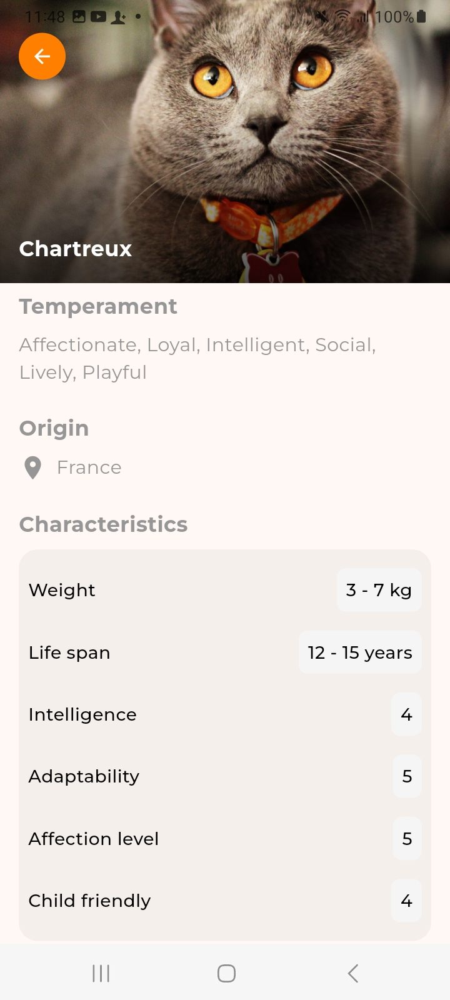

# Breed Cats

Aplicación móvil desarrollada bajo el framework Flutter en su versión 3.24.4, la cual permite visualizar una lista de razas de gatos.
Al seleccionar una raza, se permite la navegación a una segunda vista, donde se presenta la información completa de la raza

## Integración con TheCatAPI

Este proyecto utiliza la API de TheCatAPI para obtener información sobre las razas de gatos. Para más detalles sobre su uso, visita su sitio web oficial.
- [TheCatAPI](https://thecatapi.com/)

## Estructura del proyecto

El proyecto se encuentra estructurado de la siguiente manera:

### Arquitectura

Este proyecto sigue el patrón de Clean Architecture, lo que asegura la separación de responsabilidades y la escalabilidad. El cual se divide en tres capas principales:

- **Domain**: Contiene las entidades y los casos de uso de la aplicación
- **Infrastructure**: Contiene la implementación de los casos de uso y la capa de datos
- **Presentation**: Contiene la capa de presentación de la aplicación y el manejo del estado

### Implementaciones

Estas son algunas de las librerías utilizadas en el proyecto:

- [http](https://pub.dev/packages/http) - Para realizar peticiones HTTP
- [provider](https://pub.dev/packages/provider) - Para manejar el estado de la aplicación
- [flutter_dotenv](https://pub.dev/packages/flutter_dotenv) - Para cargar variables de entorno
- [go_router](https://pub.dev/packages/go_router) - Para manejar la navegación de la aplicación

### Ejecutar el proyecto

Para ejecutar el proyecto, es necesario tener instalado Flutter en su versión 3.24.4 y crear el archivo `.env` 
en la raíz del proyecto con la siguiente estructura:
    
    ```env
    API_URL = https://api.thecatapi.com/v1
    API_KEY_CATS = api_key
    ```

## Capturas de pantalla

A continuación, se presentan algunas capturas de pantalla de la aplicación.

<p align="center">
  
  
  
  
</p>

